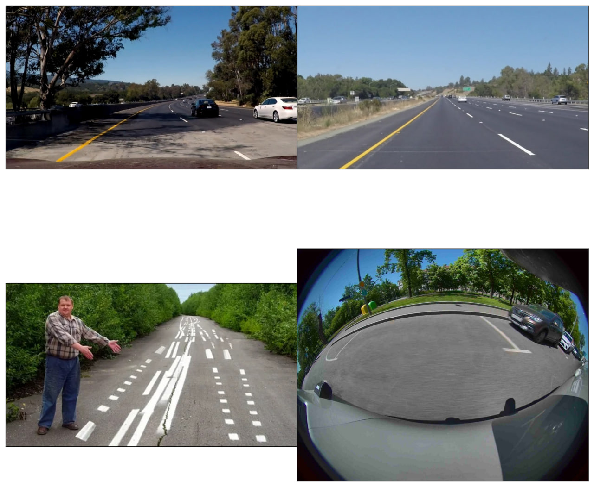
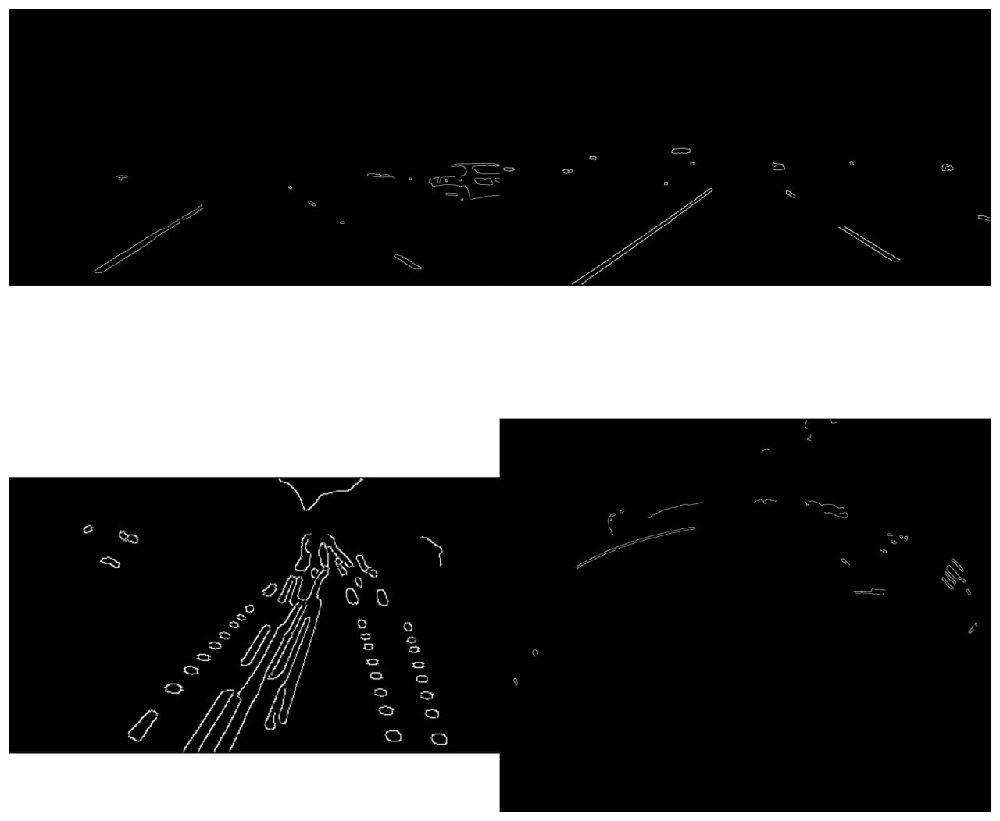

## Курсовая работа от Атома АО "Кама" на тему "Распознавание разметки парковочных мест по fisheye камерам". Дата: 2024

---

Были рассмотрены два подхода: классический и нейросетевой.

### Классический подход:

Результаты классического подхода распознавания дорожной разметки (распознавание дорожной разметки только парковочных мест невозможно из-за ограничений существующих алгоритмов):

### Нейросетевой подход:

Решением было дообучение нейросети для детекции парковочного места и сегментации всей дорожной разметки, а затем объединение результатов моделей, в результате которого остается только та дорожная разметка, которая пересекается с баундинг боксом детектированного парковочного места.

Были выбраны нейросетевые архитектуры YOLOv8 и DeepLabV3+ (в качестве бэкбона используем ResNet-50), которые балансируют между скоростью и качеством.

Результаты нейросетевого подхода детекции парковочных мест при помощи YOLO v8 на датасете Parking Finder, который я исказил fisheye фильтром для повышения точности модели при работе с fisheye изображениями:
/examplesOfUse/test6.png>)
/examplesOfUse/bbox.jpg>)

Результаты нейросетевого подхода сегментации дорожной разметки при помощи DeepLabV3+ на fisheye датасете WoodScape:
/examplesOfUse/test6.png>)

Результат работы алгоритма, который сочетает результаты моделей, решающих задачи детекции и сегментации. Fisheye изображение:
/examplesOfUse/result.png>)
/examplesOfUse/afterPhotoshop.jpg>)

---

Так же был неудачный опыт при работе с pinhole датасетом ApolloScape, не получилось добиться высокой точности модели, потому что сжатая версия датасета оказалась достаточно однотипной, аугментация данных не помогла, модель хорошо сегментирует разметку только на изображениях с серой цветовой палитрой, к тому же изображения были pinhole, это сильно ухудшило бы качество модели при работе с fisheye изображениями.

Результаты нейросетевого подхода сегментации дорожной разметки при помощи DeepLabV3+ на pinhole датасете ApolloScape:
/examplesOfUse/test1.png>)
/examplesOfUse/test2.png>)

Результат работы алгоритма, который сочетает результаты моделей, решающих задачи детекции и сегментации. Pinhole изображение:
/examplesOfUse/result.png>)
/examplesOfUse/afterPhotoshop.jpg>)

### Ссылки на скачивание датасетов:
ApolloScape: https://apolloscape.auto/lane_segmentation.html
WoodScape: https://drive.google.com/drive/folders/1X5JOMEfVlaXfdNy24P8VA-jMs0yzf_HR?usp=sharing
Parking Finder: https://universe.roboflow.com/aiml-the-lebron-project/parking-finder/dataset/1

---

Обратите внимание на .gitignore, в репозитории нет датасетов и весов моделей, поскольку они слишком тяжелые для выгрузки.